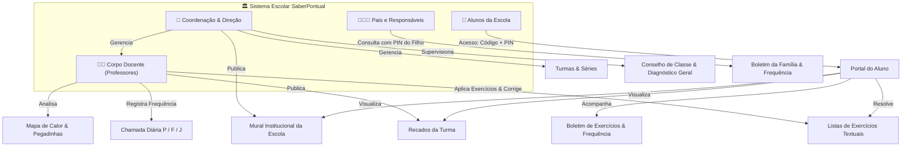
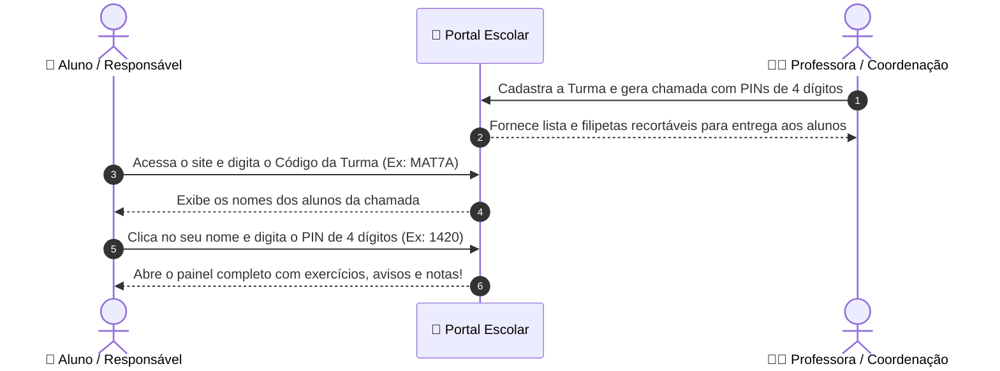
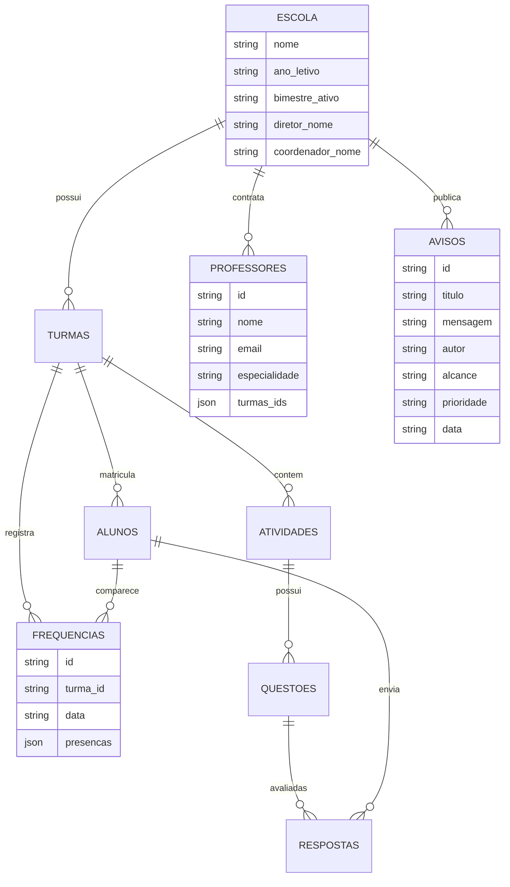

# 🏫 Sistema Escolar Completo (SaberPontual)

> **Documento Executivo de Gestão & Manual do Sistema Escolar Integrado**  
> **Status:** Sistema 100% Funcional e Pronto para Demonstração & Piloto  
> **Pilares:** Gestão Escolar & Coordenação, Diário da Professora, Portal do Aluno & Família

---

## 🎯 1. Visão Geral e Propósito

Transformar a rotina de exercícios e acompanhamento pedagógico em uma **experiência digital leve, rápida e acolhedora**, eliminando a sobrecarga de correção em papel para os professores, aproximando as famílias da escola e fornecendo um diagnóstico imediato para a coordenação pedagógica.

### 🌟 Pilares do Sistema
1. **Zero Fricção para Alunos e Famílias:** Acesso direto pelo celular com **Código da Turma + PIN de 4 Dígitos** (sem exigência de e-mail, senhas complexas ou aplicativos pesados).
2. **Questões Ágeis e Leves (100% Texto no MVP):** Enunciados e alternativas textuais diretas — carrega instantaneamente mesmo em 3G/4G com planos pré-pagos.
3. **Módulo de Gestão da Coordenação & Direção:** Visão macro da escola, indicadores de rendimento global, mural de avisos institucionais e atas de Conselho de Classe.
4. **Diário da Professora Integrado:** Frequência diária rápida (P/F/J), lista de chamada com PINs, mapas de calor apontando pegadinhas e emissão de filipetas recortáveis.
5. **Espaço dos Pais / Responsáveis:** Consulta transparente com o mesmo PIN do filho para acompanhar notas, presenças e recados dos professores.

---

## 🏛️ 2. Arquitetura dos 3 Perfis Integrados



---

## 🎒 3. Fluxo de Acesso Simplificado (Sem E-mail)



---

## 📝 4. Estrutura Pedagógica de Cada Questão (100% Textual)

1. **Enunciado:** Pergunta clara, contextualizada e objetiva.
2. **Alternativas (A, B, C, D):** 4 alternativas com seleção nítida e confortável ao toque.
3. **Dica Amiga (💡):** Pista reflexiva sem entregar a resposta direta.
4. **Por Que Errou?:** Explicação detalhada da pegadinha da alternativa errada marcada pelo aluno.
5. **Explicação Correta:** O passo a passo do raciocínio certo.

---

## 🗄️ 5. Modelo de Dados Completo



---

## 🚀 6. Como Testar os 3 Perfis

Basta abrir o arquivo `index.html` em qualquer navegador (Google Chrome, Microsoft Edge, Safari, Firefox).

### 1. 🏛️ Como Testar a Direção & Coordenação:
1. No topo, clique em **"🏛️ Direção & Coordenação"**.
2. **Visão Geral:** Veja os indicadores globais da escola (Total de Alunos, Professores, Aproveitamento Global e Turmas por segmento: Fund I, Fund II e Médio).
3. **Corpo Docente:** Veja os professores cadastrados e cadastre novos professores vinculando disciplinas e turmas.
4. **Mural Institucional:** Publique comunicados oficiais para toda a escola ou turmas específicas.
5. **Conselho de Classe:** Selecione a turma (ex: `7º Ano A`) e veja a ata consolidada com médias de notas, frequência e parecer pedagógico ("Aprovado / Destaque", "Atenção / Reforço"), pronta para imprimir!

### 2. 👩‍🏫 Como Testar a Professora:
1. No topo, clique em **"👩‍🏫 Professora"**.
2. **Frequência Diária:** Escolha a data, clique em "Todos Presentes" ou alterne individualmente entre `P` (Presente), `F` (Falta) ou `J` (Justificada) e salve a chamada.
3. **Mural da Turma:** Publique recados exclusivos para a turma (ex: "Trazer régua na próxima aula").
4. **Chamada & PINs:** Veja a lista com PINs de 4 dígitos, botão de reset e impressão das filipetas recortáveis (`✂️ Recorte aqui`).
5. **Exercícios & Questões:** Crie atividades, duplique para outra turma em 1 clique ou adicione questões com dicas e pegadinhas.
6. **Mapa de Calor:** Veja em tempo real as alternativas que mais confundiram a turma e receba orientações pedagógicas para a aula de revisão.

### 3. 🎒 Como Testar o Aluno & Família:
1. No topo, clique em **"🎒 Aluno & Família"**.
2. Digite o código da turma `MAT7A` (ou clique no atalho rápido de teste).
3. Escolha o aluno **Lucas Oliveira** (PIN: `1420`) ou **Beatriz Santos** (PIN: `3891`).
4. Veja o painel do aluno com:
   * **Mural de Avisos** da coordenação e da professora logo na entrada.
   * **Métricas do Aluno:** Frequência escolar (ex: 100% de Presença) e Aproveitamento médio nas atividades.
   * Lista de **Exercícios Pendentes** e **Concluídos**.
5. Clique no botão **"👨‍👩‍👧 Espaço dos Pais"** no cabeçalho do aluno para testar a visão dos responsáveis, exibindo o boletim formativo e frequência com visual transparente e acolhedor!

---

## 📁 Estrutura de Arquivos do Projeto

```
SISTEMA ESCOLAR/
├── index.html          # Shell SPA responsivo com Tailwind CSS, FontAwesome e navegação dos 3 perfis
├── css/
│   └── styles.css      # Estilização customizada, PIN pad, mapa de calor e regras de impressão (@media print)
├── js/
│   ├── data.js         # Dados iniciais da escola, professores, turmas, alunos, avisos, frequências e questões
│   ├── storage.js      # Persistência local (CRUD escola, professores, avisos, frequências, mapa de calor e conselho)
│   ├── student.js      # Portal do Aluno & Família (Código -> PIN -> Avisos -> Tarefas -> Dicas -> Espaço dos Pais)
│   ├── teacher.js      # Painel da Professora (Chamada & PINs, Frequência diária, Atividades, Mural e Mapa de Calor)
│   ├── management.js   # Painel da Direção & Coordenação (Dashboard global, Corpo docente, Mural e Conselho de Classe)
│   └── app.js          # Orquestrador global, alternância entre os 3 perfis, notificações toast e modais
└── README.md           # Documentação executiva completa e manual de uso
```
